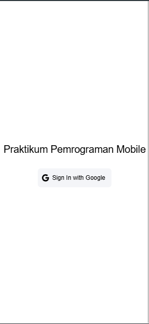
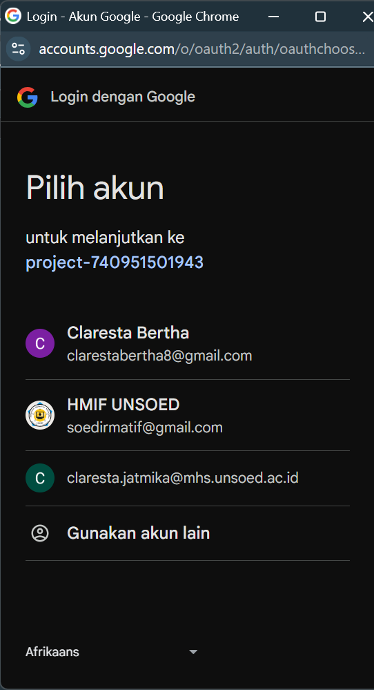
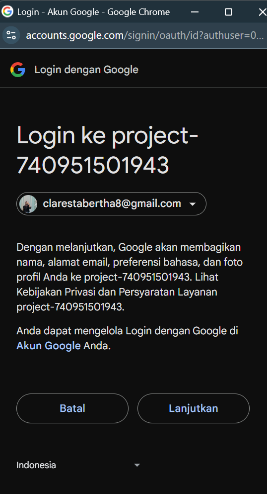
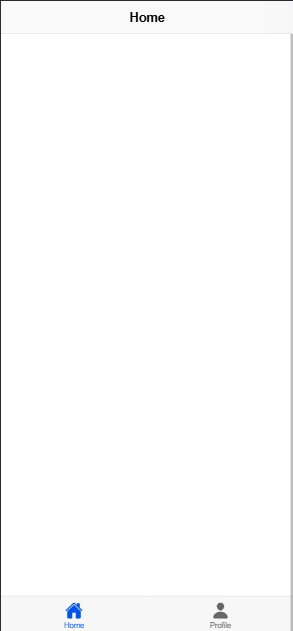
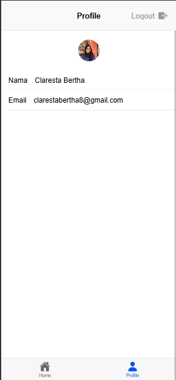

# Tugas 9
Nama : Claresta Berthalita Jatmika

NIM : H1D022050

Shift Baru: F

## Jelaskan bagaimana cara dari mulai autentikasi login, hingga aplikasi mendapatkan username dan profil kita dari akun google.
### 1. Halaman Login

Saat pertama kali aplikasi dijalankan akan ditampilkan halaman login seperti gambar diatas. Pada halaman ini terdapat tombol "Sign In with Google" yang disediakan oleh 'Firebase' untuk mengautentikasi google. Saat tombol ditekan, maka fungsi 'loginWithGoogel()' yang ada pada file 'auth.ts' dipanggil.
```vue
<ion-button @click="login" color="light">
                    <ion-icon slot="start" :icon="logoGoogle"></ion-icon>
                    <ion-label>Sign In with Google</ion-label>
                </ion-button>
const authStore = useAuthStore();

const login = async () => {
    await authStore.loginWithGoogle();
};
```

### 2. Autentikasi google

Pada fungsi 'loginWithGoogle()', pertama aplikasi menginisialisasi autentikasi google dengan menggunakan library '@codetrix-studio/capacitor-google-auth'. Ini dilakukan dengan memanggil 'GoogleAuth.initialize()', yang membutuhkan 'clientId' dan izin untuk mendapatkan akses profil dan email pengguna. 
Kemudian aplikasi akan memanggil 'GoogleAuth.signIn()' untuk meminta pengguna login menggunakan akun google mereka seperti gambar diatas. 


Setelah itu akan dikembalikan informasi autentikasi berupa 'idToken'. Dengan 'idToken' tersebut, aplikasi akan membuat kredensial firebase dengan 'GoogleAuthProvider.credential(idToken)' dan menggunakannya untuk autentikasi pada firebase dengan 'signInWithCredential(auth, credential)' dan hasilnya dapat dilihat digambar diatas. Jika berhasil, firebase akan mengembalikan objek result yang berisi data user. Data user ini lalu disimpan di store Pinia dengan perintah 'user.value=result.user'.
```ts
const loginWithGoogle = async () => {
        try {
            await GoogleAuth.initialize({
                clientId: '740951501943-ek7u7oa22h1ngdeb1r0tmk31if9uvphf.apps.googleusercontent.com',
                scopes: ['profile', 'email'],
                grantOfflineAccess: true,
            });

            const googleUser = await GoogleAuth.signIn();

            const idToken = googleUser.authentication.idToken;

            const credential = GoogleAuthProvider.credential(idToken);

            const result = await signInWithCredential(auth, credential);

            user.value = result.user;

            router.push("/home");
        } catch (error) {
            console.error("Google sign-in error:", error);
            
            const alert = await alertController.create({
                header: 'Login Gagal!',
                message: 'Terjadi kesalahan saat login dengan Google. Coba lagi.',
                buttons: ['OK'],
            });

            await alert.present();

            throw error;
        }
    };
```

### 3. Halaman Homepage

Jika login berhasil, aplikasi akan mengarahkan menuju halaman homepage dengan menggunakan router 'router.push("/home")' yang akan membawa pengguna ke halaman 'HomePage.vue'. Router diatur sedemikian rupa di 'index.ts' dengan menggunakan 'router.beforeEach' untuk memeriksa status autentikasi pengguna sebelum ke halaman tujuan. Jika pengguna sudah login dan mencoba mengakses login maka akan langsung diarahkan ke homepage. Tampilan home seperti gambar diatas.
```ts
 {
    path: '/home',
    name: 'home',
    component: HomePage,
    meta: {
      isAuth: true,
    },
  },

router.beforeEach(async (to, from, next) => {
  const authStore = useAuthStore();

  if (authStore.user === null) {
    await new Promise<void>((resolve) => {
      const unsubscribe = onAuthStateChanged(auth, () => {
        resolve();
        unsubscribe();
      });
    });
  }

  if (to.path === '/login' && authStore.isAuth) {
    next('/home');
  } else if (to.meta.isAuth && !authStore.isAuth) {
    next('/login');
  } else {
    next();
  }
});
```

### 4. Halaman Profil

Pada halaman profil seperti gambar diatas, data pengguna tersimpan store pinia dengan perintah 'authStore.user' yang digunakan untuk menampilkan profil pengguna. Untuk foto progil diambil dari firebase atau menggunakan gambar yang disediakan. Jika foto gagal dimuat, fallback gambar digunakan dengan fungsi handleImageError'. Data pengguna seperti nama 'user.displayName', email 'user.email', dan foto profil 'authstore.user' yang tersimpan dalam store. Informasi ini diperoleh setelah login berhasil dan digunakan untuk halaman profil yang menampilkan data pengguna. 
```vue
<ion-content :fullscreen="true">
            <!-- Avatar -->
            <div id="avatar-container">
                <ion-avatar>
                    
                </ion-avatar>
            </div>

            <!-- Data Profile -->
            <ion-list>
                <ion-item>
                    <ion-input label="Nama" :value="user?.displayName" :readonly="true"></ion-input>
                </ion-item>

                <ion-item>
                    <ion-input label="Email" :value="user?.email" :readonly="true"></ion-input>
                </ion-item>
            </ion-list>

            <!-- Tabs Menu -->
            <TabsMenu />
        </ion-content>

const authStore = useAuthStore();
const user = computed(() => authStore.user);

const userPhoto = computed(() => {
    const userId = user.value?.uid || 'default'; // Gunakan 'default' jika user ID tidak tersedia
    return `img/bertha.jpg`; // Path ke folder img/fotoprofile
});

// Fallback jika gambar gagal dimuat
function handleImageError(event: Event) {
    const img = event.target as HTMLImageElement;
    img.src = 'https://ionicframework.com/docs/img/demos/avatar.svg'; // Fallback ke avatar default
}
```

### 5. Logout
Pada halaman profil terdapat tombol logout di pojok kanan atas. Apabila ditekan maka akan memanggil 'authStore.logout()' yang akan menghapus data pengguna dari aplikasi dan mengarahkan kembali ke halaman login
```vue
const logout = () => {
    authStore.logout();
};
```