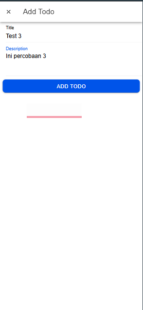
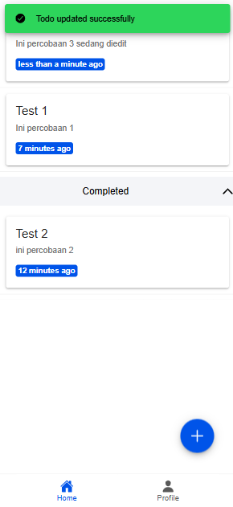

# Tugas 9
Nama : Claresta Berthalita Jatmika

NIM : H1D022050

Shift Baru: F

## Jelaskan bagaimana cara dari mulai autentikasi login, hingga aplikasi mendapatkan username dan profil kita dari akun google.
### 1. Halaman Login

Saat pertama kali aplikasi dijalankan akan ditampilkan halaman login seperti gambar diatas. Pada halaman ini terdapat tombol "Sign In with Google" yang disediakan oleh 'Firebase' untuk mengautentikasi google. Saat tombol ditekan, maka fungsi 'loginWithGoogel()' yang ada pada file 'auth.ts' dipanggil.
```vue
<ion-button @click="login" color="light">
                    <ion-icon slot="start" :icon="logoGoogle"></ion-icon>
                    <ion-label>Sign In with Google</ion-label>
                </ion-button>
const authStore = useAuthStore();

const login = async () => {
    await authStore.loginWithGoogle();
};
```

### 2. Autentikasi google

Pada fungsi 'loginWithGoogle()', pertama aplikasi menginisialisasi autentikasi google dengan menggunakan library '@codetrix-studio/capacitor-google-auth'. Ini dilakukan dengan memanggil 'GoogleAuth.initialize()', yang membutuhkan 'clientId' dan izin untuk mendapatkan akses profil dan email pengguna. 
Kemudian aplikasi akan memanggil 'GoogleAuth.signIn()' untuk meminta pengguna login menggunakan akun google mereka seperti gambar diatas. 


Setelah itu akan dikembalikan informasi autentikasi berupa 'idToken'. Dengan 'idToken' tersebut, aplikasi akan membuat kredensial firebase dengan 'GoogleAuthProvider.credential(idToken)' dan menggunakannya untuk autentikasi pada firebase dengan 'signInWithCredential(auth, credential)' dan hasilnya dapat dilihat digambar diatas. Jika berhasil, firebase akan mengembalikan objek result yang berisi data user. Data user ini lalu disimpan di store Pinia dengan perintah 'user.value=result.user'.
```ts
const loginWithGoogle = async () => {
        try {
            await GoogleAuth.initialize({
                clientId: '740951501943-ek7u7oa22h1ngdeb1r0tmk31if9uvphf.apps.googleusercontent.com',
                scopes: ['profile', 'email'],
                grantOfflineAccess: true,
            });

            const googleUser = await GoogleAuth.signIn();

            const idToken = googleUser.authentication.idToken;

            const credential = GoogleAuthProvider.credential(idToken);

            const result = await signInWithCredential(auth, credential);

            user.value = result.user;

            router.push("/home");
        } catch (error) {
            console.error("Google sign-in error:", error);
            
            const alert = await alertController.create({
                header: 'Login Gagal!',
                message: 'Terjadi kesalahan saat login dengan Google. Coba lagi.',
                buttons: ['OK'],
            });

            await alert.present();

            throw error;
        }
    };
```

### 3. Halaman Homepage

Jika login berhasil, aplikasi akan mengarahkan menuju halaman homepage dengan menggunakan router 'router.push("/home")' yang akan membawa pengguna ke halaman 'HomePage.vue'. Router diatur sedemikian rupa di 'index.ts' dengan menggunakan 'router.beforeEach' untuk memeriksa status autentikasi pengguna sebelum ke halaman tujuan. Jika pengguna sudah login dan mencoba mengakses login maka akan langsung diarahkan ke homepage. Tampilan home seperti gambar diatas.
```ts
 {
    path: '/home',
    name: 'home',
    component: HomePage,
    meta: {
      isAuth: true,
    },
  },

router.beforeEach(async (to, from, next) => {
  const authStore = useAuthStore();

  if (authStore.user === null) {
    await new Promise<void>((resolve) => {
      const unsubscribe = onAuthStateChanged(auth, () => {
        resolve();
        unsubscribe();
      });
    });
  }

  if (to.path === '/login' && authStore.isAuth) {
    next('/home');
  } else if (to.meta.isAuth && !authStore.isAuth) {
    next('/login');
  } else {
    next();
  }
});
```

### 4. Halaman Profil

Pada halaman profil seperti gambar diatas, data pengguna tersimpan store pinia dengan perintah 'authStore.user' yang digunakan untuk menampilkan profil pengguna. Untuk foto progil diambil dari firebase atau menggunakan gambar yang disediakan. Jika foto gagal dimuat, fallback gambar digunakan dengan fungsi handleImageError'. Data pengguna seperti nama 'user.displayName', email 'user.email', dan foto profil 'authstore.user' yang tersimpan dalam store. Informasi ini diperoleh setelah login berhasil dan digunakan untuk halaman profil yang menampilkan data pengguna. 
```vue
<ion-content :fullscreen="true">
            <!-- Avatar -->
            <div id="avatar-container">
                <ion-avatar>
                    
                </ion-avatar>
            </div>

            <!-- Data Profile -->
            <ion-list>
                <ion-item>
                    <ion-input label="Nama" :value="user?.displayName" :readonly="true"></ion-input>
                </ion-item>

                <ion-item>
                    <ion-input label="Email" :value="user?.email" :readonly="true"></ion-input>
                </ion-item>
            </ion-list>

            <!-- Tabs Menu -->
            <TabsMenu />
        </ion-content>

const authStore = useAuthStore();
const user = computed(() => authStore.user);

const userPhoto = computed(() => {
    const userId = user.value?.uid || 'default'; // Gunakan 'default' jika user ID tidak tersedia
    return `img/bertha.jpg`; // Path ke folder img/fotoprofile
});

// Fallback jika gambar gagal dimuat
function handleImageError(event: Event) {
    const img = event.target as HTMLImageElement;
    img.src = 'https://ionicframework.com/docs/img/demos/avatar.svg'; // Fallback ke avatar default
}
```

### 5. Logout
Pada halaman profil terdapat tombol logout di pojok kanan atas. Apabila ditekan maka akan memanggil 'authStore.logout()' yang akan menghapus data pengguna dari aplikasi dan mengarahkan kembali ke halaman login
```vue
const logout = () => {
    authStore.logout();
};
```


# Tugas 10
Nama : Claresta Berthalita Jatmika

NIM : H1D022050

Shift Baru: F

## Jelaskan Proses CRUD dengan menggunakan Firebase
### 1. Menampilkan data (read)

Saat aplikasi pertama dimuat, data yang sudah ada pada firestore diambil melalui koneksi 'todos' yang terkait dengan tiap pengguna. Lalu fungsi 'loadTodos()' akan dipanggil untuk mengambil data menggunakan firebase firestore. Data yang diambil menggunakan 'getDocs()' yang disaring berdasarkan UID pengguna dan diurutkan berdasarkan 'updatedAt' atau dari terbaru ke lama. Setelah data diambil data tersebut akan disimpan dalam variabel reaktif 'todos' yang kemudian digunakan menampilkan list todo pada halaman aplikasi seperti gambar diatas.
```vue
const loadTodos = async (isLoading = true) => {
  let loading;
  if (isLoading) {
    loading = await loadingController.create({
      message: 'Loading...'
    });
    await loading.present();
  }

  try {
    todos.value = await firestoreService.getTodos();
  } catch (error) {
    console.error(error);
  } finally {
    if (loading) {
      await loading.dismiss();
    }
  }
};
```

### 2. Menambah data (Create)

Saat pengguna mengklik tombol "+", modal 'InputModal' akan terbuka untuk memasukan todo yang baru yang disediakan dalam bentuk form seperti gambar diatas. Setelah form diisi, tombol submit akan memanggil fungsi 'handleSubmit()' untuk mengirimkan data ke firestore.


Selanjutnya sistem akan mengecek apakan itu data baru atau data yang sudah diedit, jika itu merupakan data baru maka fungsi 'firestoreService.addTodo()' dipanggil dan digunakan untuk menambahkan data baru ke koleksi todos pada firestore dan akan menampilkan pesan sukses seperti gambar diatas. Data yang dikirimkan memiliki atribut 'createdAt' dan 'updatedAt' yang diatur ke waktu sekarang dengan status 'false' untuk menandakan bahwa todo belum selesai. Setelah todo ditambahkan aplikasi akan merefresh kembali daftar todo dengan fungsi 'loadTodos()'.
```vue
try {
    if (editingId.value) {
      await firestoreService.updateTodo(editingId.value, todo as Todo);
      await showToast('Todo updated successfully', 'success', checkmarkCircle);
    } else {
      await firestoreService.addTodo(todo as Todo);
      await showToast('Todo added successfully', 'success', checkmarkCircle);
    }
}
```

### 3. Mengedit data (Update)

Ketika pengguna menekan tombol edit pada todo yang dipilih,modal dari 'InputModal' akan terbuka dengan data yang sudah ada. Data tersebut dimuat ke dalam form dan dapat diedit sesuai dengan kebutuhan pengguna seperti gambar diatas. 


Setelah selesai mengedit data, tombol submit ditekan dan akan memanggil fungsi 'handleSubmit()' yang akan memeriksa apakah id todo sedang diedit. Jika ya, maka data todo akan diperbarui dengan memanggil fungsi 'firestoreService.updateTodo()'. Dan apabila berhasil maka terdapat pesan sukses seperti gambar diatas ini.
```vue
try {
    if (editingId.value) {
      await firestoreService.updateTodo(editingId.value, todo as Todo);
      await showToast('Todo updated successfully', 'success', checkmarkCircle);
    } else {
      await firestoreService.addTodo(todo as Todo);
      await showToast('Todo added successfully', 'success', checkmarkCircle);
    }
}
```

### 4. Menghapus data (Delete)

Saat pengguna mengklik tombol hapus seperti gambar diatas pada todo yang dipilih, fungsi 'handleDelete()' akan dipanggil. 


Pada fungsi ini menggunakan fungsi 'firestoreService.deleteTodo()' dengan parameter id todo yang akan dihapus. Apabila berhasil maka akan keluar pesan sukses bahwa data telah terhapus seperti gambar diatas. Setelah todo dihapus dari firestore daftar todo akan diperbarui dengan memanggil 'loadTodos()'
```vue
const handleDelete = async (deleteTodo: Todo) => {
  try {
    await firestoreService.deleteTodo(deleteTodo.id!);
    await showToast('Todo deleted successfully', 'success', checkmarkCircle);
    loadTodos();
  } catch (error) {
    await showToast('Failed to delete todo', 'danger', closeCircle);
    console.error(error);
  }
};
```

### 5. Mark as completed


Ketika pengguna akan menandai todo sebagai selesai, mereka akan menekan tombol centang pada todo yang dipilih seperti gambar diatas. Selanjutnya fungsi 'handleMarkAsCompleted()' akan dipanggil untuk memperbarui status todo. 


Fungsi tersebut akan mengubah status todo menjadi 'true' atau selesai dan memperbarui 'updateAt' ke waktu sekarang. Selanjutnya fungsi 'firestoreService.updateTodo()' akan dipanggil untuk memperbarui dokumen pada firestore dengan status yang baru dan mengirimkan pesan sukses jika berhasil seperti gambar diatas.
```vue
const handleStatus = async (statusTodo: Todo) => {
  const slidingItem = itemRefs.value.get(statusTodo.id!);
  await slidingItem?.close();
  try {
    await firestoreService.updateStatus(statusTodo.id!, !statusTodo.status);
    await showToast(
      `Todo marked as ${!statusTodo.status ? 'completed' : 'active'}`,
      'success',
      checkmarkCircle
    );
    loadTodos();
  } catch (error) {
    await showToast('Failed to update status', 'danger', closeCircle);
    console.error(error);
  }
};
```


# Bonus
### Bagaimana Build Ionic kalian ke bentuk Apk dan disertai buktinya dan langkahnya
#### 1. Bangun aplikasi dengan ionic
Dengan menggunakan perintah 'ionic build' akan mengompilasi proyek anda dan menghasilkan file build. Hasil build ini adalah aplikasi yang siap untuk diubah menjadi aplikasi native.

#### 2. Instalasi dependencies untuk android jika belum
Dengan perintah 'npm install @capacitor/android' aka menginstal dependesi capicator untuk platform android.

#### 3. Menambahkan platform android
Dengan perintah 'ionic capacitor add android' akan menambahkan platform android ke proyek

#### 4. Salin hasil build ke folder android
Dengan perintah 'npx cap copy' 

#### 5. Sinkronisasi dengan platform android
Dengan perintah 'npx cap sync android'

#### 6. Buka proyek android
Dengan perintah 'ionic cap run android --target=device' dikarenakan saya tidak menggunakan android studio jadi pakainya emulator. 


mungkin untuk bukti hanya bisa di login saja karena pada firebase saya set hanya untuk webview terimakasi
